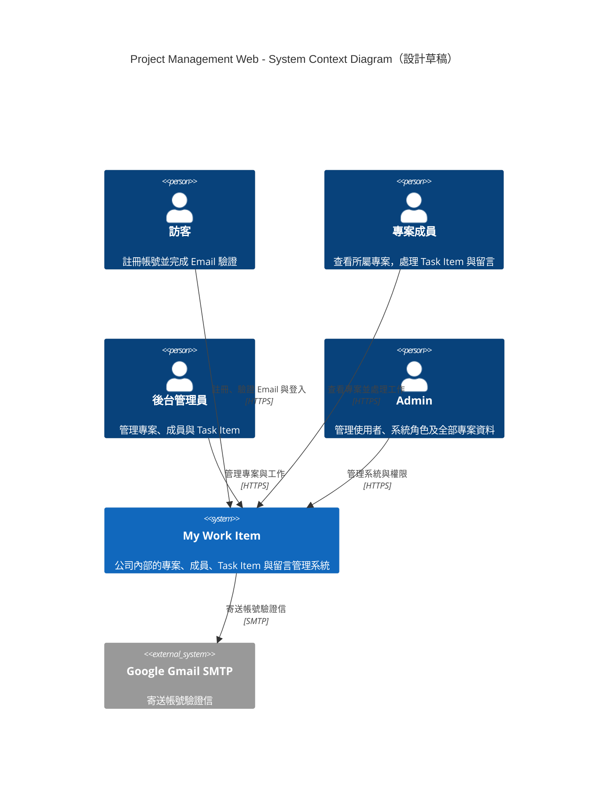
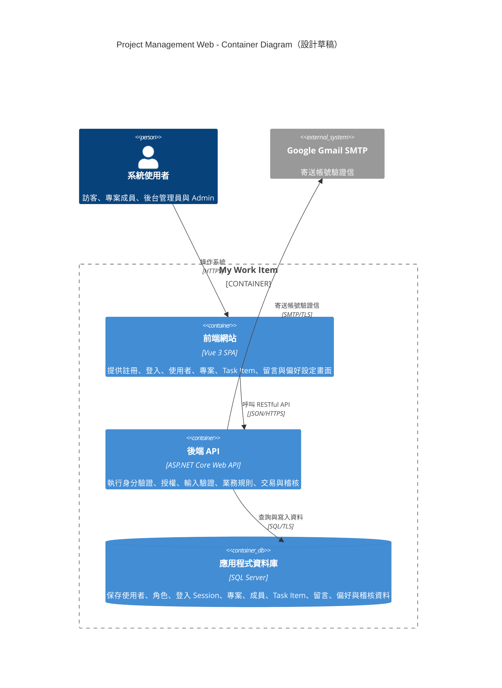
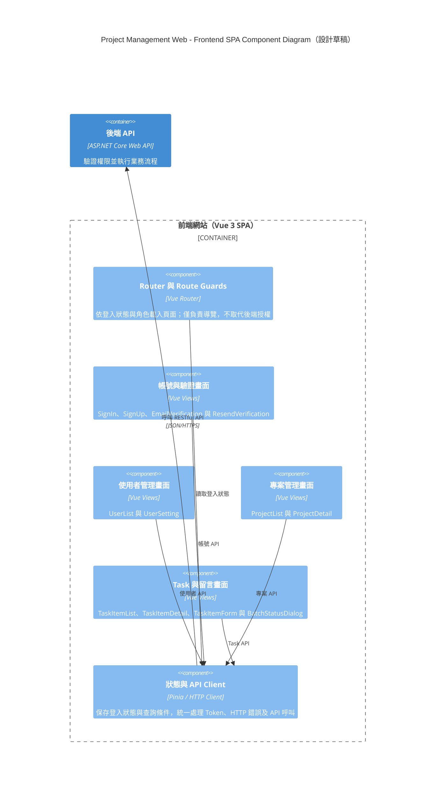
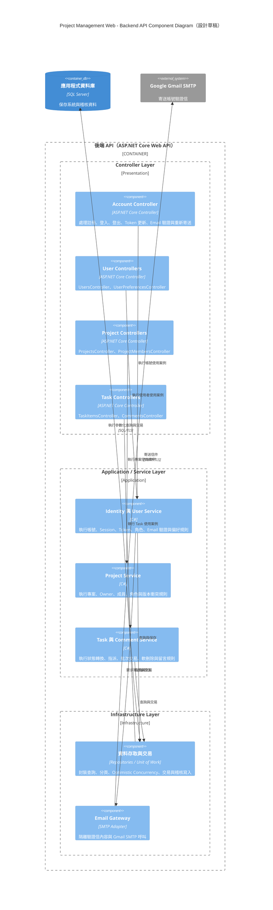
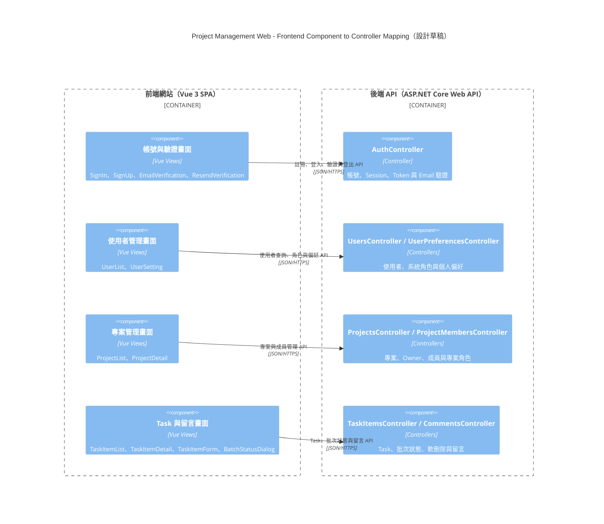

# My Work Item：C4 Level 1～Level 3

> 圖表狀態：設計草稿。實作完成後，仍須依實際程式碼、部署方式與外部服務重新核對。

## Level 1：System Context Diagram

這一層只描述使用者、My Work Item 系統，以及系統直接依賴的外部 Email 服務，不呈現 Vue、ASP.NET Core 或 SQL Server 等技術細節。

## Level 2：Container Diagram

C4 的 Container 是可執行應用程式或資料儲存的責任邊界，不等同 Docker Container。My Work Item 在 MVP 階段由前端 SPA、後端 API 與關聯式資料庫組成；Email 服務位於系統邊界之外。

## Level 3A：Frontend SPA Component Diagram

這張圖只展開 Vue 3 SPA。畫面 Component 依 Day6 的八張草圖分組；Email 驗證、Task 新增表單與批次狀態確認雖然尚未有草圖，但已由 Day3 的 User Story 明確定義，因此一併納入規劃。

## Level 3B：Backend API Controller Component Diagram

這張圖只展開 ASP.NET Core Web API。Controller 依前端畫面所需的使用案例分組，並把業務流程留在 Application Service，避免 Controller 直接存取資料庫或堆疊規則。

## Level 3C：Frontend Component 與 Controller 對應圖

標準 C4 Component Diagram 一次只展開一個 Container。下圖是為了讓開發者快速核對畫面與 Controller 責任而補充的跨 Container 對應圖，不取代 Level 3A 或 Level 3B。

## 設計邊界

- Level 1 不呈現框架、資料庫或內部元件。
- Level 2 不把頁面、Controller、Service、Repository 或資料表誤當成 Container。
- Level 3A 與 Level 3B 各自只展開一個 Container；Level 3C 是為了核對畫面與 Controller 而提供的跨 Container 補充圖。
- 畫面與 Controller 的對應代表功能責任，不表示 Vue View 會略過 API Client 或直接呼叫 C# 類別。
- Controller 名稱是依目前 User Story 與 UI 草圖提出的設計命名；後端實作完成後，須再依實際 Route 與類別名稱回頭校正。
- Component 表示責任單元，不保證每個元件只會對應一個 Class 或一個檔案。
- 前端的按鈕顯示與 Disabled 狀態只改善操作體驗，所有授權與狀態轉換仍由後端重新驗證。
- Task 批次更新由應用服務建立單一交易邊界，任一項失敗即整批不更新。
- Project 與 Task 更新透過版本欄位處理 Optimistic Concurrency，衝突時回傳 HTTP 409。
- Email 僅用於 Day3 明確要求的帳號驗證；本圖未自行加入 Task 到期提醒或背景排程。
