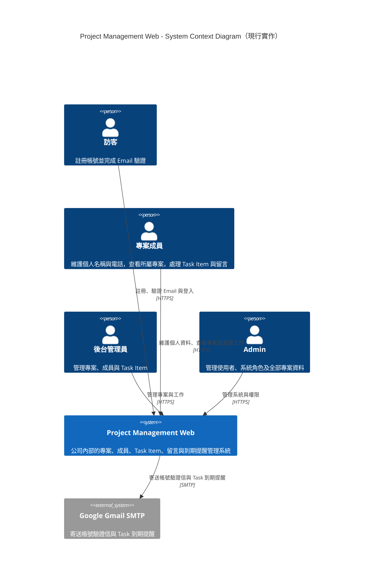
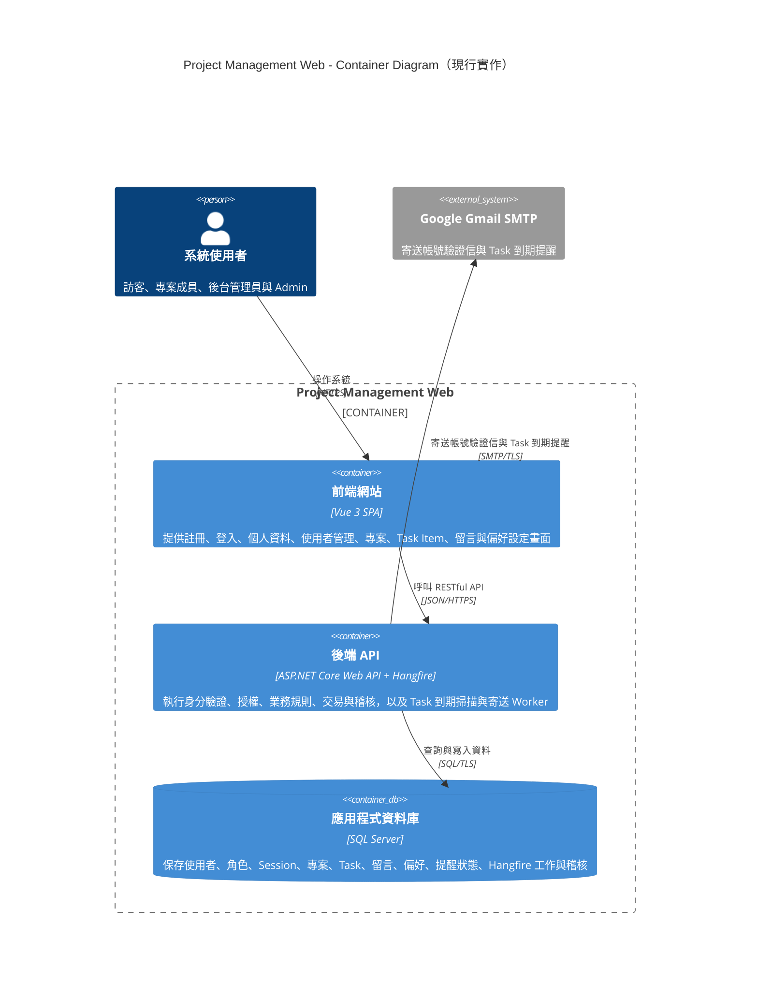
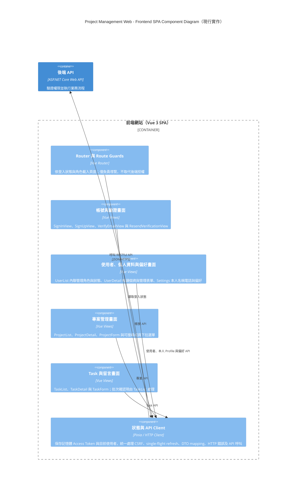
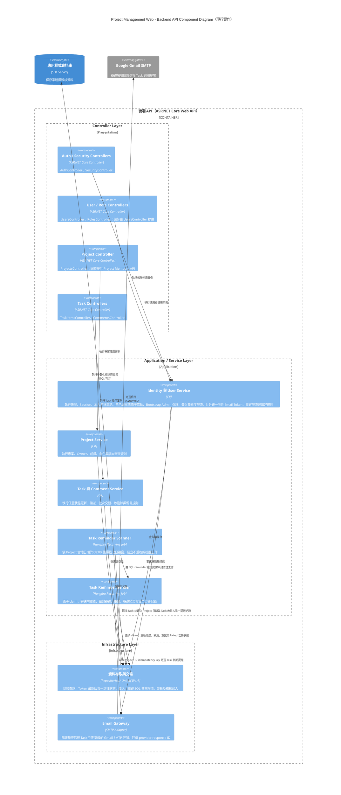
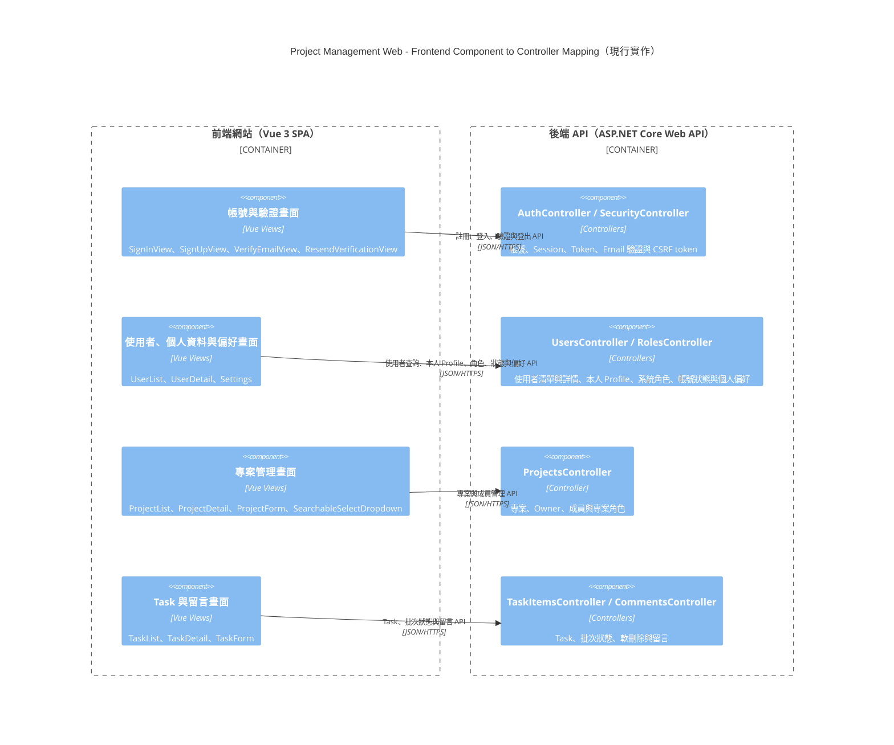

# Project Management Web：C4 Level 1～Level 3

> 圖表狀態：已於 2026-09-24 依目前 Vue 3 SPA、ASP.NET Core Controllers／Services、Hangfire、SQL Server、SMTP 與 Docker Compose 實作同步；本輪納入本人 Profile、使用者清單內聯管理及可搜尋成員下拉選單。

## Level 1：System Context Diagram

這一層只描述使用者、Project Management Web 系統，以及系統直接依賴的外部 Email 服務，不呈現 Vue、ASP.NET Core 或 SQL Server 等技術細節。

## Level 2：Container Diagram

C4 的 Container 是可執行應用程式或資料儲存的責任邊界，不等同 Docker Container。Project Management Web 在 MVP 階段由前端 SPA、後端 API 與關聯式資料庫組成；Email 服務位於系統邊界之外。

## Level 3A：Frontend SPA Component Diagram

這張圖只展開目前 Vue 3 SPA。Component 依實際 Router、Views、Pinia stores、typed service contracts 與 HTTP adapters 分組；Email 驗證、Task 表單與批次狀態確認皆已實作並納入測試。

## Level 3B：Backend API Controller Component Diagram

這張圖只展開 ASP.NET Core Web API。Controller 依前端畫面所需的使用案例分組，並把業務流程留在 Application Service，避免 Controller 直接存取資料庫或堆疊規則。

## Level 3C：Frontend Component 與 Controller 對應圖

標準 C4 Component Diagram 一次只展開一個 Container。下圖是為了讓開發者快速核對畫面與 Controller 責任而補充的跨 Container 對應圖，不取代 Level 3A 或 Level 3B。

## 設計邊界

- Level 1 不呈現框架、資料庫或內部元件。
- Level 2 不把頁面、Controller、Service、Repository 或資料表誤當成 Container。
- Level 3A 與 Level 3B 各自只展開一個 Container；Level 3C 是為了核對畫面與 Controller 而提供的跨 Container 補充圖。
- 畫面與 Controller 的對應代表功能責任，不表示 Vue View 會略過 API Client 或直接呼叫 C# 類別。
- Controller 名稱與責任已依目前實際 Route 與類別校正；新增 Controller 或拆分 route 時必須同步此圖。
- Component 表示責任單元，不保證每個元件只會對應一個 Class 或一個檔案。
- 前端的按鈕顯示與 Disabled 狀態只改善操作體驗，所有授權、rowVersion 與目標狀態 enum 值仍由後端重新驗證；Project／Task 的四種合法狀態可任意互轉並包含相同狀態更新。
- Task 批次更新由應用服務建立單一交易邊界，任一項失敗即整批不更新。
- Project 與 Task 更新透過版本欄位處理 Optimistic Concurrency，衝突時回傳 HTTP 409。
- Email 驗證與 Task 到期提醒均為現行 runtime 功能。提醒由 Hangfire Scanner／Sender、SQL 唯一紀錄與原子 claim、5／15／60 分鐘 retry，以及 DB／安全結構化 Log 告警組成；Hangfire schema 由 migrator 初始化。
