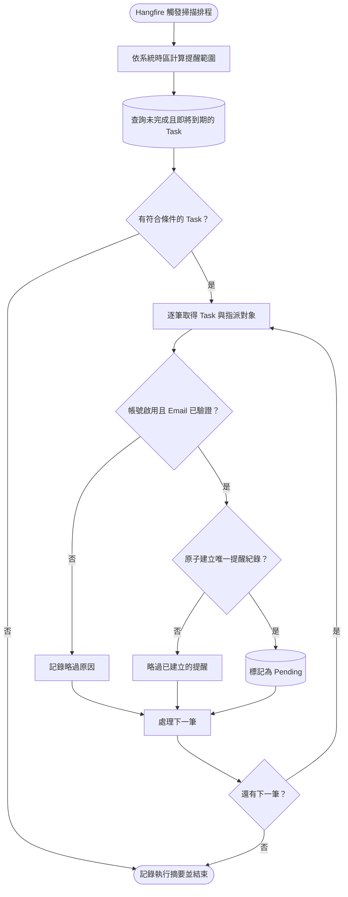
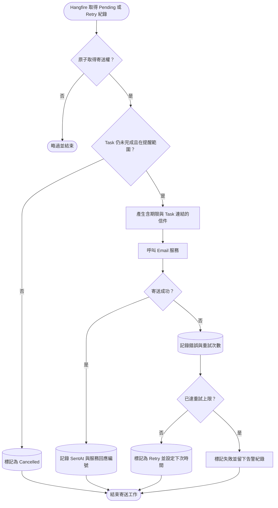

## E-mail 任務到期提醒

這個功能分成「找出需要提醒的 Task」與「寄送單封提醒信」兩段。兩段分開後，即使 Email 服務暫時失敗，也不必重新掃描全部 Task。

### 掃描到期任務

### 寄送單封提醒信

「即將到期」要有明確且可設定的範圍，例如以系統時區判斷 `現在時間 <= 交付期限 <= 提醒截止時間`。查詢條件至少包含 Task 尚未完成、指派對象帳號仍啟用，以及 Email 已完成驗證。

為了避免排程重複執行或多台主機同時處理，寄送紀錄應以 Task、收件人與提醒規則建立唯一限制，並以原子操作取得寄送權。寄送前還要重新讀取 Task，避免使用者剛完成任務，系統卻仍寄出舊提醒。

Email 是外部服務；若服務已收信，但程式在寫回成功紀錄前中斷，重試仍可能造成極少數重複信件。若供應商支援 Idempotency Key，應使用寄送紀錄編號作為 Key；否則要透過寄送回應編號、有限次重試及告警紀錄降低風險。