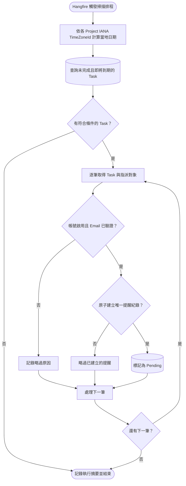
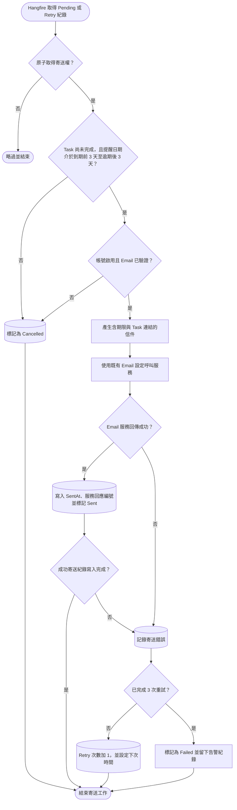

## E-mail 任務到期提醒

這個功能分成「找出需要提醒的 Task」與「寄送單封提醒信」兩段。兩段分開後，即使 Email 服務暫時失敗，也不必重新掃描全部 Task。

### 掃描到期任務

### 寄送單封提醒信

提醒排程依每個 Project 的 IANA `TimeZoneId`，在 Project 當地時間每日 08:00 取得一次掃描資格。同一 Project／當地提醒日期最多執行一次；08:00 漏跑時，在同一當地日恢復後補跑，跨日不補前一日。Project 當地日期同時作為排程與提醒冪等鍵，DST 重複或跳時不得造成同一日期重複或遺漏。

未完成的 Task 從到期前第 3 天開始每天提醒，到期當天仍會提醒；逾期後第 1 天至第 3 天繼續每天提醒，超過第 3 天便停止。同一個持續未完成的 Task，最多會在到期前第 3、2、1 天、到期當天，以及逾期第 1、2、3 天各產生一次提醒。查詢條件至少包含 Task 尚未完成、指派對象帳號仍啟用，以及 Email 已完成驗證。

為了避免排程重複執行或多台主機同時處理，寄送紀錄應以 Task、收件人與提醒規則建立唯一限制，並以原子操作取得寄送權。寄送前還要重新讀取 Task，避免使用者剛完成任務，系統卻仍寄出舊提醒。

Email 是外部服務；若服務已收信，但程式在寫回成功紀錄前中斷，重試仍可能造成極少數重複信件。若供應商支援 Idempotency Key，應使用寄送紀錄編號作為 Key。初次寄送失敗後最多重試 3 次，間隔依序為 5、15、60 分鐘；達到上限後標記失敗，同時寫入資料庫與結構化 log 告警，本期不提供告警管理 UI。本功能不另外限制寄件網域或訂定業務層的寄送速率，以 Email 服務回傳成功，且系統成功記錄寄送時間與服務回應編號，作為成功寄出的判定。
