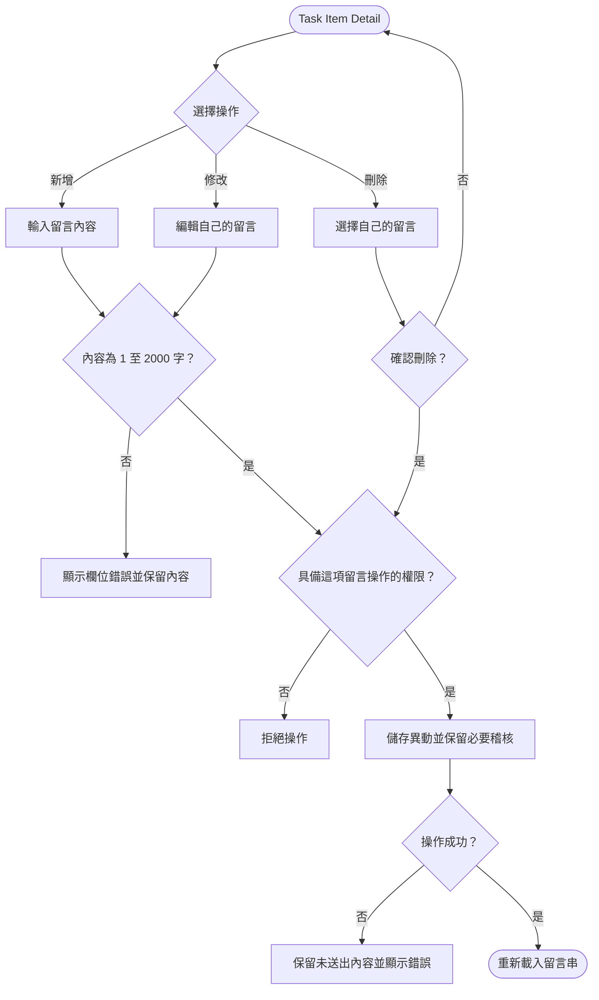

# Task Item 留言

```mermaid
flowchart TB
    commentStart([Task Item Detail]) --> commentAction{選擇操作}
    commentAction -->|新增| enterComment[輸入留言內容]
    commentAction -->|修改| editOwnComment[編輯自己的留言]
    commentAction -->|刪除| chooseComment[選擇自己的留言]
    enterComment --> validateComment{內容為 1 至 2000 字？}
    editOwnComment --> validateComment
    validateComment -->|否| showCommentValidation[顯示欄位錯誤並保留內容]
    validateComment -->|是| authorizeComment{具備這項留言操作的權限？}
    chooseComment --> confirmCommentDelete{確認刪除？}
    confirmCommentDelete -->|否| commentStart
    confirmCommentDelete -->|是| authorizeComment
    authorizeComment -->|否| forbiddenComment[拒絕操作]
    authorizeComment -->|是| persistComment[儲存異動並保留必要稽核]
    persistComment --> commentSucceeded{操作成功？}
    commentSucceeded -->|否| retainComment[保留未送出內容並顯示錯誤]
    commentSucceeded -->|是| refreshComments([重新載入留言串])
```
