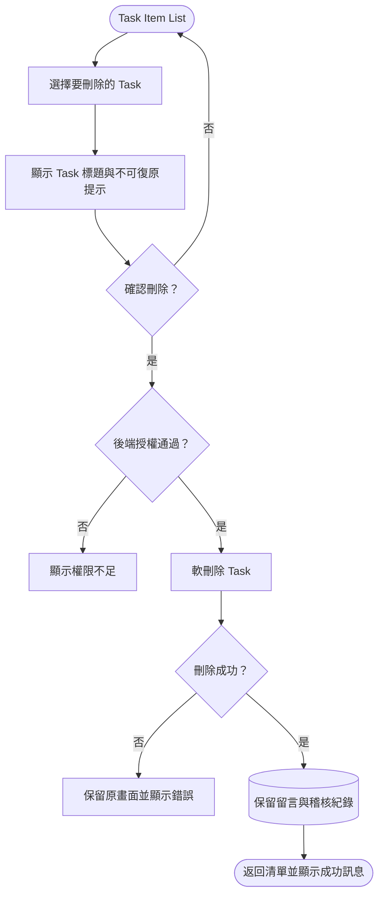

# 刪除 Task Item（後台使用者）

> 實作同步：2026-09-24。對應 `DELETE /api/v1/projects/{projectId}/task-items/{taskId}?rowVersion=...`，由 `TaskItemsController` 與 `TaskService` 執行。

MVP 採軟刪除，因此一般清單不再顯示該 Task，但留言與稽核紀錄仍須保留，不能使用未經評估的 Cascade Delete 一併清除。
