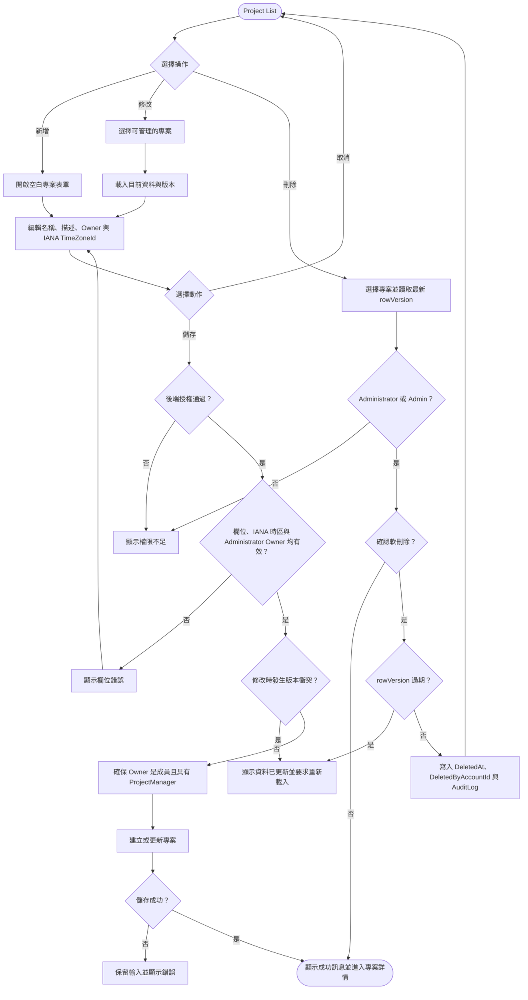

# 建立與修改專案

> 實作同步：2026-09-24。建立、詳情、修改與軟刪除均由 `ProjectsController` 提供；Code 由後端產生，表單不接受 Code。

Project 名稱儲存前 trim 後必須為 1–200 個字元；Description 為選填，若有值則 trim 後最多 4000 個字元。Owner 必須是已啟用、Email 已驗證且系統角色恰為 `Administrator` 的帳號；`Admin`、`User`、`Viewer` 均不得擔任。建立時 Owner 會自動成為成員並取得 `ProjectManager`；修改專案時，新 Owner 還必須已是該專案成員，缺少 `ProjectManager` 時由同一交易補上。舊 Owner 原有的 Project Roles 不會自動移除。

每個 Project 必須明確指定合法的 IANA `TimeZoneId`，不得為空白、Windows timezone ID 或未知值，也不得在新增時自動套用系統預設。既有 Project 的時區由部署設定透過 migration 回填；設定缺少或無效時 migration 必須 fail-fast。

Project 軟刪除只開放給 `Administrator` 與 `Admin`，且必須帶最新 rowVersion。成功後 Project 與所屬資料從一般 scope 隱藏，但成員、Task、Comment 與 history 不實體刪除；本期無 restore 或 permanent-delete 入口。
