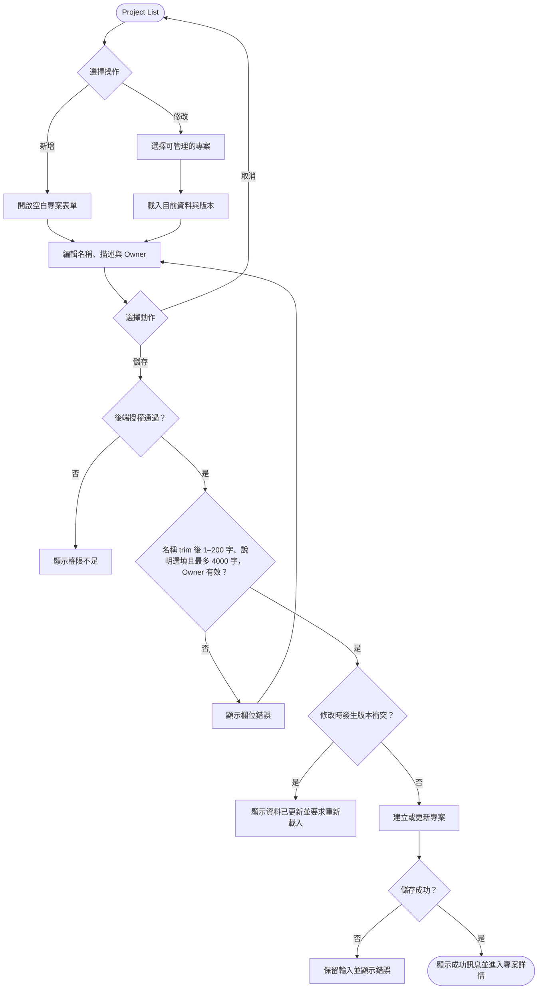

# 建立與修改專案

```mermaid
flowchart TB
    projectList([Project List]) --> projectAction{選擇操作}
    projectAction -->|新增| newProject[開啟空白專案表單]
    projectAction -->|修改| selectProject[選擇可管理的專案]
    selectProject --> editProject[載入目前資料與版本]
    newProject --> projectForm[編輯名稱、描述與 Owner]
    editProject --> projectForm
    projectForm --> submitProject{選擇動作}
    submitProject -->|取消| projectList
    submitProject -->|儲存| authorizeProject{後端授權通過？}
    authorizeProject -->|否| forbiddenProject[顯示權限不足]
    authorizeProject -->|是| projectValid{名稱 trim 後 1–200 字、說明選填且最多 4000 字，Owner 有效？}
    projectValid -->|否| showProjectValidation[顯示欄位錯誤]
    showProjectValidation --> projectForm
    projectValid -->|是| versionConflict{修改時發生版本衝突？}
    versionConflict -->|是| showProjectConflict[顯示資料已更新並要求重新載入]
    versionConflict -->|否| saveProject[建立或更新專案]
    saveProject --> saveProjectSucceeded{儲存成功？}
    saveProjectSucceeded -->|否| retainProjectInput[保留輸入並顯示錯誤]
    saveProjectSucceeded -->|是| projectDetail([顯示成功訊息並進入專案詳情])
```

建立專案時，Owner 必須是已啟用的有效帳號；修改專案時，Owner 必須已是該專案成員。Project 名稱與 Description 儲存前均會 trim，Description 可以留空。
