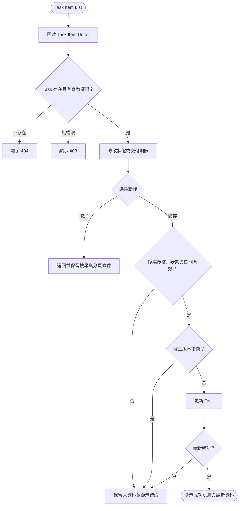

## 從詳細頁修改 Task（前台使用者）

```mermaid
flowchart TB
    detailStart([Task Item List]) --> openTask[開啟 Task Item Detail]
    openTask --> taskAccessible{Task 存在且有查看權限？}
    taskAccessible -->|不存在| notFoundTask[顯示 404]
    taskAccessible -->|無權限| forbiddenTaskDetail[顯示 403]
    taskAccessible -->|是| editAllowedFields[修改狀態或交付期限]
    editAllowedFields --> submitDetail{選擇動作}
    submitDetail -->|取消| returnToList[返回並保留搜尋與分頁條件]
    submitDetail -->|儲存| validateDetail{後端授權、狀態與日期有效？}
    validateDetail -->|否| retainDetail[保留原資料並顯示錯誤]
    validateDetail -->|是| detailConflict{發生版本衝突？}
    detailConflict -->|是| retainDetail
    detailConflict -->|否| updateDetail[更新 Task]
    updateDetail --> detailSucceeded{更新成功？}
    detailSucceeded -->|否| retainDetail
    detailSucceeded -->|是| refreshDetail([顯示成功訊息與最新資料])
```