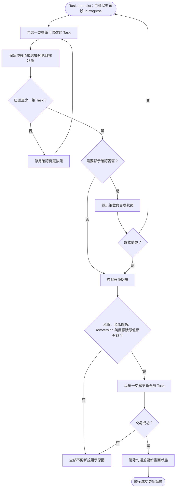

# 批次修改 Task 狀態（前台使用者）

```mermaid
flowchart TB
    batchStart([Task Item List；目標狀態預設 InProgress]) --> selectEditable[勾選一或多筆可修改的 Task]
    selectEditable --> chooseStatus[保留預設值或選擇其他目標狀態]
    chooseStatus --> batchReady{已選至少一筆 Task？}
    batchReady -->|否| disableSubmit[停用確認變更按鈕]
    disableSubmit --> selectEditable
    batchReady -->|是| needConfirmation{需要顯示確認視窗？}
    needConfirmation -->|是| showBatchSummary[顯示筆數與目標狀態]
    showBatchSummary --> confirmBatch{確認變更？}
    confirmBatch -->|否| batchStart
    needConfirmation -->|否| validateBatch[後端逐筆驗證]
    confirmBatch -->|是| validateBatch
    validateBatch --> batchValid{權限、指派關係、rowVersion 與目標狀態值都有效？}
    batchValid -->|否| rollbackBatch[全部不更新並顯示原因]
    batchValid -->|是| updateBatch[以單一交易更新全部 Task]
    updateBatch --> batchSucceeded{交易成功？}
    batchSucceeded -->|否| rollbackBatch
    batchSucceeded -->|是| refreshBatch[清除勾選並更新畫面狀態]
    refreshBatch --> batchFinished([顯示成功更新筆數])
```

批次更新不能成功一半、失敗一半。後端應在同一個交易中驗證並更新所有 Task，任何一筆失敗就全部回復原狀。`Pending`、`InProgress`、`Blocked`、`Completed` 四種狀態允許任意互轉，也允許更新為相同狀態；不會因 source→target 組合而拒絕。
