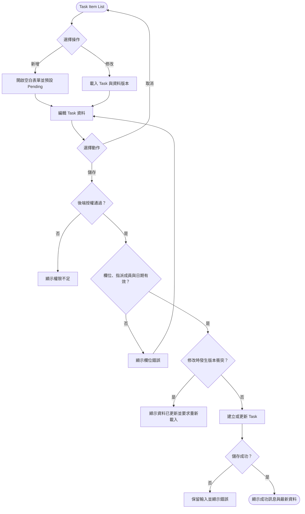

# 新增與修改 Task Item（後台使用者）

```mermaid
flowchart TB
    adminTaskList([Task Item List]) --> taskAction{選擇操作}
    taskAction -->|新增| newTask[開啟空白表單並預設 Pending]
    taskAction -->|修改| selectTask[載入 Task 與資料版本]
    newTask --> taskForm[編輯 Task 資料]
    selectTask --> taskForm
    taskForm --> submitTask{選擇動作}
    submitTask -->|取消| adminTaskList
    submitTask -->|儲存| authorizeTask{後端授權通過？}
    authorizeTask -->|否| forbiddenTask[顯示權限不足]
    authorizeTask -->|是| taskValid{欄位、指派成員與日期有效？}
    taskValid -->|否| showTaskValidation[顯示欄位錯誤]
    showTaskValidation --> taskForm
    taskValid -->|是| taskConflict{修改時發生版本衝突？}
    taskConflict -->|是| showTaskConflict[顯示資料已更新並要求重新載入]
    taskConflict -->|否| saveTask[建立或更新 Task]
    saveTask --> taskSaveSucceeded{儲存成功？}
    taskSaveSucceeded -->|否| retainTaskInput[保留輸入並顯示錯誤]
    taskSaveSucceeded -->|是| taskDetail([顯示成功訊息與最新資料])
```

Task 的專案、標題與指派對象為必填，指派對象必須是有效專案成員，開始時間也不能晚於交付期限。