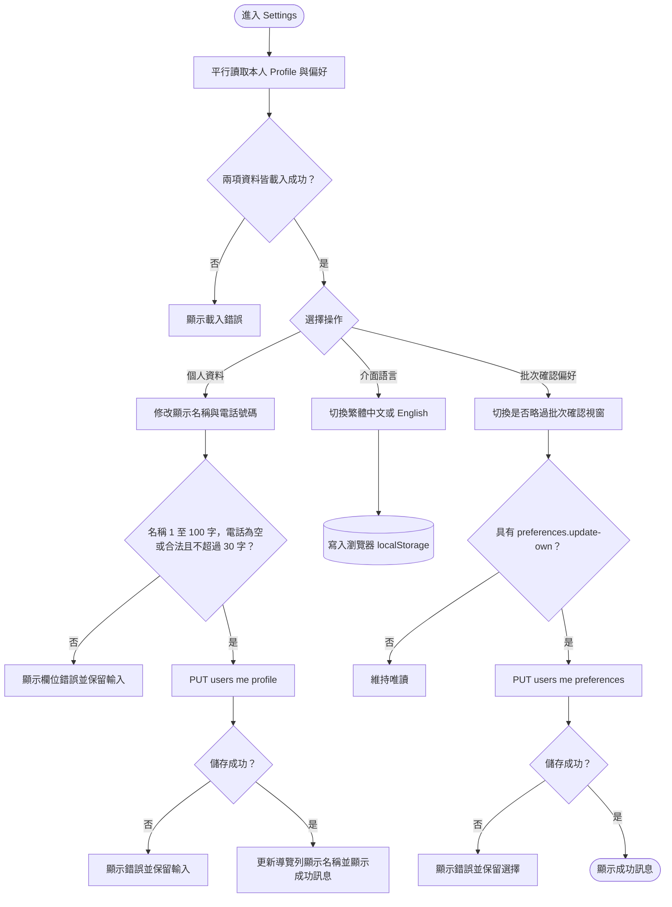

# 管理個人資料與偏好

本人 Profile 只包含 `name` 與 `phoneNumber`，不允許修改帳號、Email、系統角色或啟用狀態。空白電話會正規化為 `null`；電話異動後 `PhoneNumberConfirmed` 會重設為 false。Profile endpoint 只依登入身分鎖定本人，因此 `Viewer` 與 Email 尚未驗證帳號也可以維護自己的名稱與電話。
