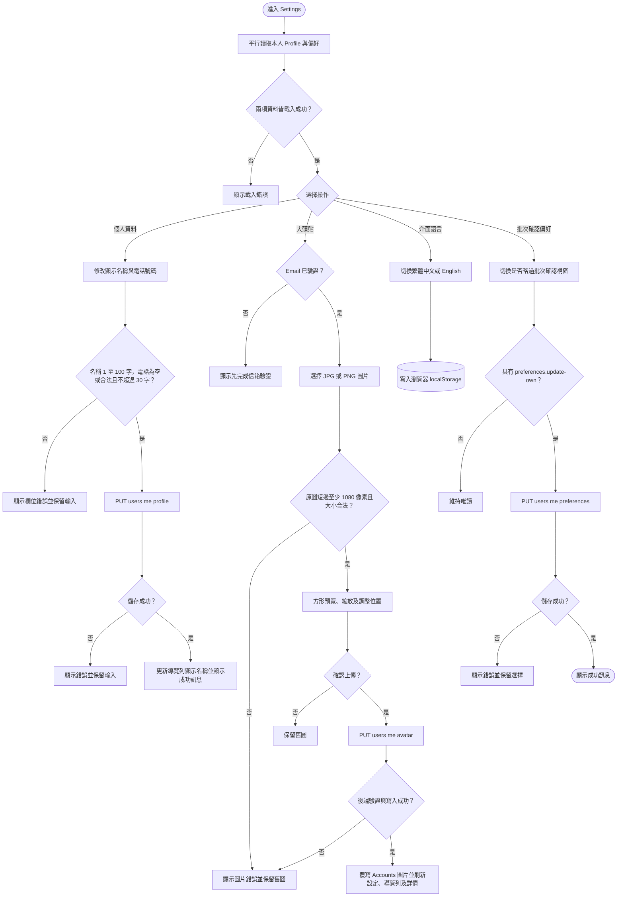

# 管理個人資料與偏好

```mermaid
flowchart TB
    settingsStart([進入 Settings]) --> loadSettings[平行讀取本人 Profile 與偏好]
    loadSettings --> loadSucceeded{兩項資料皆載入成功？}
    loadSucceeded -->|否| showLoadError[顯示載入錯誤]
    loadSucceeded -->|是| chooseSettings{選擇操作}
    chooseSettings -->|個人資料| editProfile[修改顯示名稱與電話號碼]
    editProfile --> validateProfile{名稱 1 至 100 字，電話為空或合法且不超過 30 字？}
    validateProfile -->|否| showFieldErrors[顯示欄位錯誤並保留輸入]
    validateProfile -->|是| saveProfile[PUT users me profile]
    saveProfile --> profileSaved{儲存成功？}
    profileSaved -->|否| showProfileError[顯示錯誤並保留輸入]
    profileSaved -->|是| updateCurrentUser[更新導覽列顯示名稱並顯示成功訊息]
    chooseSettings -->|大頭貼| emailVerified{Email 已驗證？}
    emailVerified -->|否| showVerifyHint[顯示先完成信箱驗證]
    emailVerified -->|是| selectImage[選擇 JPG 或 PNG 圖片]
    selectImage --> imageValid{原圖短邊至少 1080 像素且大小合法？}
    imageValid -->|否| showImageError[顯示圖片錯誤並保留舊圖]
    imageValid -->|是| cropImage[方形預覽、縮放及調整位置]
    cropImage --> confirmCrop{確認上傳？}
    confirmCrop -->|否| keepAvatar[保留舊圖]
    confirmCrop -->|是| uploadAvatar[PUT users me avatar]
    uploadAvatar --> uploadSucceeded{後端驗證與寫入成功？}
    uploadSucceeded -->|否| showImageError
    uploadSucceeded -->|是| refreshAvatar[覆寫 Accounts 圖片並刷新設定、導覽列及詳情]
    chooseSettings -->|介面語言| changeLocale[切換繁體中文或 English]
    changeLocale --> saveLocale[(寫入瀏覽器 localStorage)]
    chooseSettings -->|批次確認偏好| changePreference[切換是否略過批次確認視窗]
    changePreference --> canUpdatePreference{具有 preferences.update-own？}
    canUpdatePreference -->|否| keepReadOnly[維持唯讀]
    canUpdatePreference -->|是| savePreference[PUT users me preferences]
    savePreference --> preferenceSaved{儲存成功？}
    preferenceSaved -->|否| showPreferenceError[顯示錯誤並保留選擇]
    preferenceSaved -->|是| showPreferenceSuccess([顯示成功訊息])
```

本人 Profile 只包含 `name` 與 `phoneNumber`，不允許修改帳號、Email、系統角色或啟用狀態。空白電話會正規化為 `null`；電話異動後 `PhoneNumberConfirmed` 會重設為 false。Profile endpoint 只依登入身分鎖定本人，因此 `Viewer` 與 Email 尚未驗證帳號也可以維護自己的名稱與電話。

大頭貼是獨立於名稱／電話的 API。後端依目前登入身分與資料庫中的 Email 驗證狀態檢查寫入，不依角色或 Function 判斷。前端送出 1080 × 1080 剪裁結果後，後端重新驗證並編碼，只在成功時覆寫 `Accounts.AvatarImage`；取消或失敗時保留原值。資料庫只保存目前圖片，不保存原圖或舊版。讀取他人圖片沿用使用者詳情的 `accounts.read` 可見範圍。
