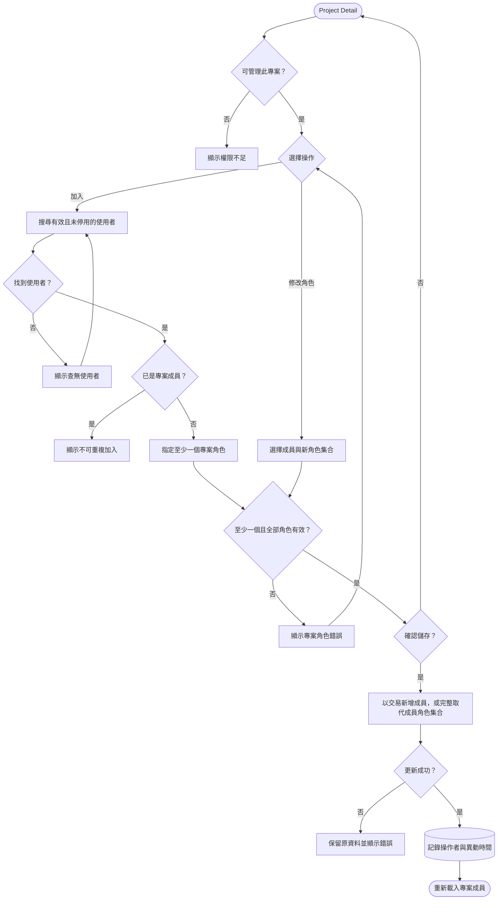
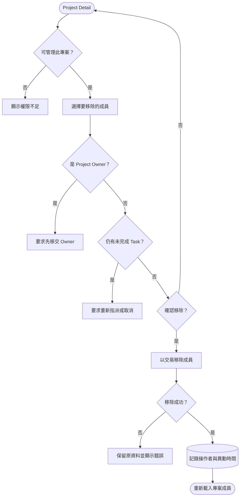

# 管理專案成員

## 加入成員或修改專案角色

```mermaid
flowchart TB
    memberStart([Project Detail]) --> authorizeMember{可管理此專案？}
    authorizeMember -->|否| forbiddenMember[顯示權限不足]
    authorizeMember -->|是| memberAction{選擇操作}
    memberAction -->|加入| searchAccount[搜尋有效且未停用的使用者]
    searchAccount --> accountFound{找到使用者？}
    accountFound -->|否| showNoAccount[顯示查無使用者]
    showNoAccount --> searchAccount
    accountFound -->|是| duplicateMember{已是專案成員？}
    duplicateMember -->|是| showDuplicate[顯示不可重複加入]
    duplicateMember -->|否| assignProjectRoles[指定至少一個專案角色]
    memberAction -->|修改角色| editProjectRoles[選擇成員與新角色集合]
    assignProjectRoles --> rolesValid{至少一個且全部角色有效？}
    editProjectRoles --> rolesValid
    rolesValid -->|否| showRoleError[顯示專案角色錯誤]
    showRoleError --> memberAction
    rolesValid -->|是| saveMember{確認儲存？}
    saveMember -->|否| memberStart
    saveMember -->|是| updateMember[以交易新增成員，或完整取代成員角色集合]
    updateMember --> memberSucceeded{更新成功？}
    memberSucceeded -->|否| retainMemberState[保留原資料並顯示錯誤]
    memberSucceeded -->|是| writeMemberAudit[(記錄操作者與異動時間)]
    writeMemberAudit --> memberFinished([重新載入專案成員])
```

## 移除專案成員

```mermaid
flowchart TB
    removalStart([Project Detail]) --> authorizeRemoval{可管理此專案？}
    authorizeRemoval -->|否| forbiddenRemoval[顯示權限不足]
    authorizeRemoval -->|是| selectRemoval[選擇要移除的成員]
    selectRemoval --> isOwner{是 Project Owner？}
    isOwner -->|是| requireOwnerTransfer[要求先移交 Owner]
    isOwner -->|否| hasOpenTasks{仍有未完成 Task？}
    hasOpenTasks -->|是| requireReassignment[要求重新指派或取消]
    hasOpenTasks -->|否| confirmRemoval{確認移除？}
    confirmRemoval -->|否| removalStart
    confirmRemoval -->|是| removeMember[以交易移除成員]
    removeMember --> removalSucceeded{移除成功？}
    removalSucceeded -->|否| retainRemovalState[保留原資料並顯示錯誤]
    removalSucceeded -->|是| writeRemovalAudit[(記錄操作者與異動時間)]
    writeRemovalAudit --> removalFinished([重新載入專案成員])
```

資料庫應以 `(ProjectId, AccountId)` 作為成員唯一識別，防止重複成員；並以 `(ProjectId, AccountId, ProjectRoleId)` 限制同一成員不得重複指定相同角色，不能只依賴畫面檢查。
