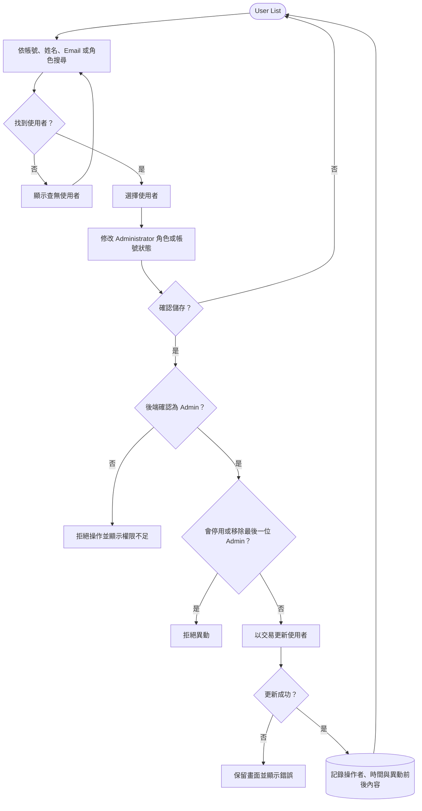

# 管理系統角色與帳號狀態

```mermaid
flowchart TB
    userList([User List]) --> searchUsers[依帳號、姓名、Email 或角色搜尋]
    searchUsers --> hasUsers{找到使用者？}
    hasUsers -->|否| showEmpty[顯示查無使用者]
    showEmpty --> searchUsers
    hasUsers -->|是| selectUser[選擇使用者]
    selectUser --> editUser[修改 Administrator 角色或帳號狀態]
    editUser --> submitUser{確認儲存？}
    submitUser -->|否| userList
    submitUser -->|是| authorizeAdmin{後端確認為 Admin？}
    authorizeAdmin -->|否| forbiddenUser[拒絕操作並顯示權限不足]
    authorizeAdmin -->|是| lastAdmin{會停用或移除最後一位 Admin？}
    lastAdmin -->|是| rejectLastAdmin[拒絕異動]
    lastAdmin -->|否| updateUser[以交易更新使用者]
    updateUser --> updateSucceeded{更新成功？}
    updateSucceeded -->|否| retainUserInput[保留畫面並顯示錯誤]
    updateSucceeded -->|是| writeUserAudit[(記錄操作者、時間與異動前後內容)]
    writeUserAudit --> userList
```