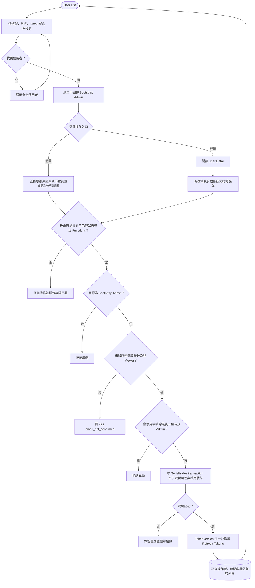

# 管理系統角色與帳號狀態

> 實作同步：2026-09-24。User List 與 User Detail 都使用 `PUT /api/v1/users/{id}/administration`；分離的 role／status endpoints 為相容契約保留。

`/users` 目前直接呼叫 `PUT /api/v1/users/{id}/administration`；角色下拉選單或狀態開關一變更就送出原子請求。`/users/{id}` 保留同一端點的完整表單。Bootstrap Admin 不出現在一般使用者清單，也不能經直接 API 被異動。
