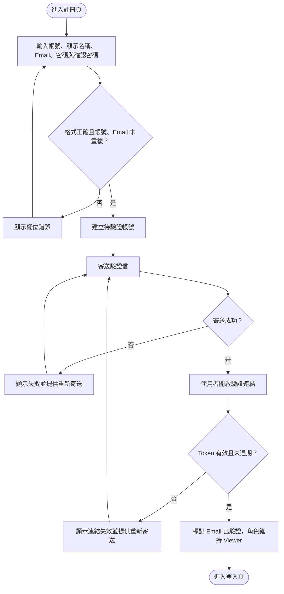
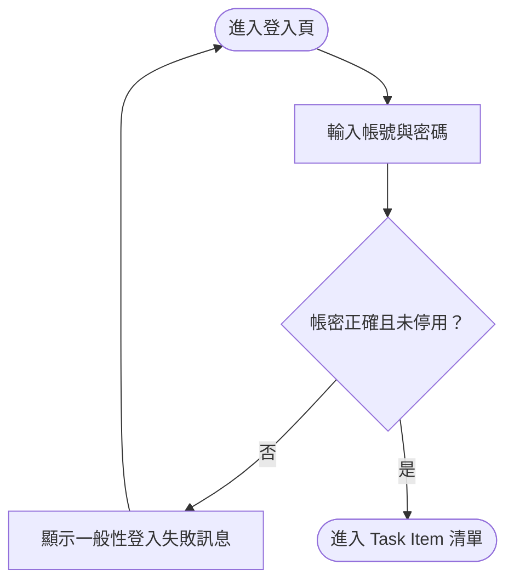

# 註冊、Email 驗證與登入

## 註冊與 Email 驗證

## 登入

登入失敗訊息不應透露帳號是否存在。已停用的帳號不能登入；Email 尚未驗證的帳號可以登入，但 Access Token 與當前帳號資料的有效系統角色固定為 `Viewer`，不得進行寫入操作。Email 驗證完成後仍維持 `Viewer`，不會自動晉升為 `User`；必須由 Admin 另行調整系統角色。驗證連結需設定有效期限，過期後由使用者重新寄送。
