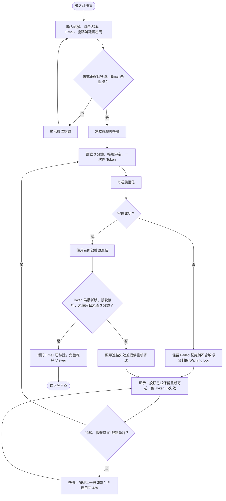
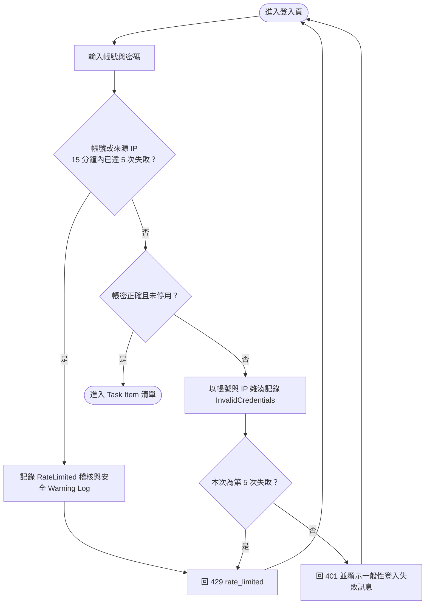

# 註冊、Email 驗證與登入

## 註冊與 Email 驗證

## 登入

登入失敗訊息不應透露帳號是否存在，且不得鎖定帳號。同一帳號或來源 IP 在滾動 15 分鐘內第 5 次失敗起回 429；共用 SQL 計數讓多執行個體採用同一門檻。只有 allowlist 內的 Proxy 才可提供 forwarded IP，否則一律使用直接連線位址；安全 Log 不記錄帳號、IP、密碼或 Token。已停用的帳號不能登入；Email 尚未驗證的帳號可以登入，但 Access Token 與當前帳號資料的有效系統角色固定為 `Viewer`，不得進行寫入操作。Email 驗證完成後仍維持 `Viewer`，不會自動晉升為 `User`；必須由 Admin 另行調整系統角色。驗證 Token 自簽發起有效 3 分鐘且只能使用一次；成功重寄才會使舊 Token 失效，SMTP 失敗只留安全 Log，不得廢止使用者原本仍有效的 Token。
