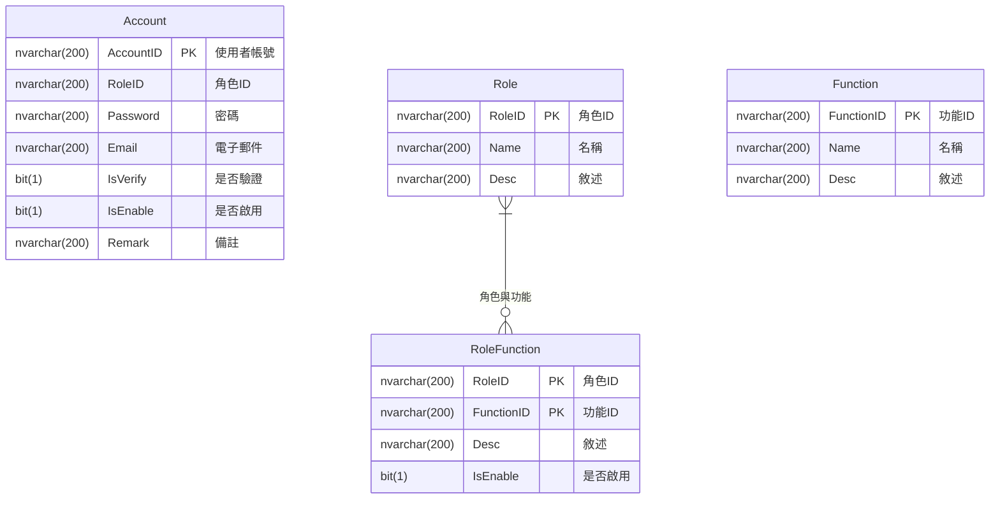
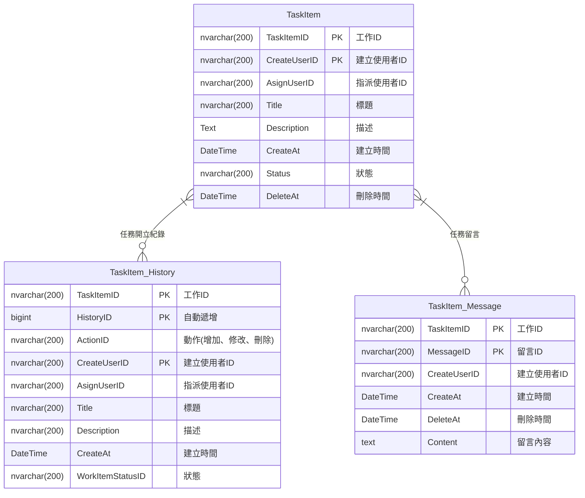
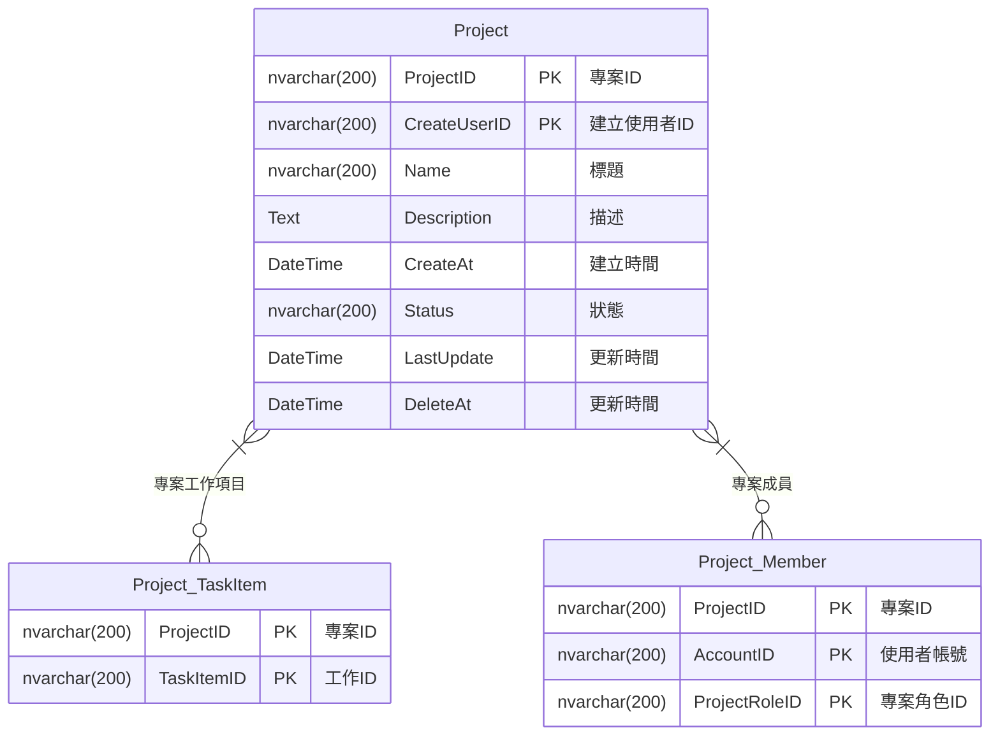
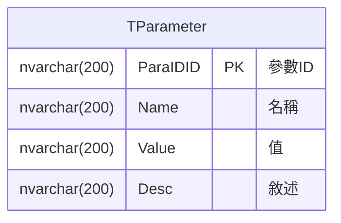
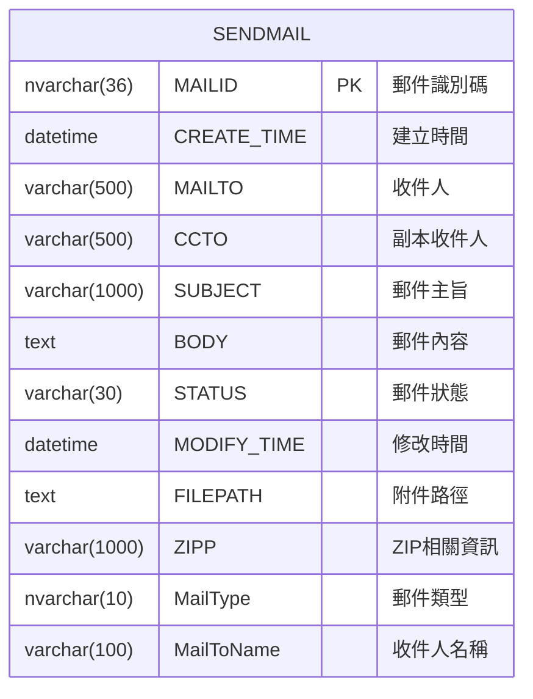
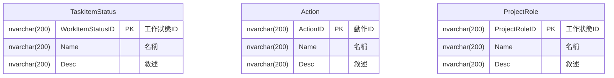

# 使用者模組

```mermaid
erDiagram
    Account{
       nvarchar(200)  AccountID PK "使用者帳號"
       nvarchar(200)  RoleID       "角色ID"
       nvarchar(200)  Password     "密碼"
       nvarchar(200)  Email        "電子郵件"
       bit(1)         IsVerify     "是否驗證"
       bit(1)         IsEnable     "是否啟用"
       nvarchar(200)  Remark       "備註"
    }

    Role{
       nvarchar(200)  RoleID PK "角色ID"
       nvarchar(200)  Name "名稱"
       nvarchar(200)  Desc "敘述"
    }

    RoleFunction{
       nvarchar(200)  RoleID PK "角色ID"
       nvarchar(200)  FunctionID PK "功能ID"
       nvarchar(200)  Desc "敘述"
       bit(1)         IsEnable "是否啟用"
    }

    Function{
      nvarchar(200)  FunctionID  PK "功能ID"
      nvarchar(200)  Name           "名稱"
      nvarchar(200)  Desc           "敘述"
    }

    Role |{--o{ RoleFunction : "角色與功能"
```

# 任務模組

```mermaid
erDiagram
TaskItem{
      nvarchar(200)  TaskItemID        PK   "工作ID"
      nvarchar(200)  CreateUserID      PK   "建立使用者ID"
      nvarchar(200)  AsignUserID            "指派使用者ID"
      nvarchar(200)  Title                  "標題"
      Text           Description            "描述"
      DateTime       CreateAt               "建立時間"
      nvarchar(200)  Status                 "狀態"
      DateTime       DeleteAt               "刪除時間"
}

TaskItem_History{
      nvarchar(200)  TaskItemID        PK   "工作ID"
      bigint         HistoryID         PK   "自動遞增"
      nvarchar(200)  ActionID               "動作(增加、修改、刪除)"
      nvarchar(200)  CreateUserID      PK   "建立使用者ID"
      nvarchar(200)  AsignUserID            "指派使用者ID"
      nvarchar(200)  Title                  "標題"
      nvarchar(200)  Description            "描述"
      DateTime       CreateAt               "建立時間"
      nvarchar(200)  WorkItemStatusID       "狀態"
}

TaskItem_Message{
      nvarchar(200)  TaskItemID        PK   "工作ID"
      nvarchar(200)  MessageID         PK   "留言ID"
      nvarchar(200)  CreateUserID           "建立使用者ID"
      DateTime       CreateAt               "建立時間"
      DateTime       DeleteAt               "刪除時間"
      text           Content                "留言內容"
}


TaskItem |{--o{ TaskItem_History : 任務開立紀錄
TaskItem |{--o{ TaskItem_Message : 任務留言

```

# 專案模組

```mermaid
erDiagram
Project{
      nvarchar(200)  ProjectID          PK   "專案ID"
      nvarchar(200)  CreateUserID       PK   "建立使用者ID"
      nvarchar(200)  Name                    "標題"
      Text           Description             "描述"
      DateTime       CreateAt                "建立時間"
      nvarchar(200)  Status                  "狀態"     
      DateTime       LastUpdate              "更新時間"
	  DateTime       DeleteAt                "更新時間"
}

Project_TaskItem{
      nvarchar(200)  ProjectID          PK   "專案ID"
	  nvarchar(200)  TaskItemID         PK   "工作ID"
}

Project_Member{
      nvarchar(200)  ProjectID          PK   "專案ID"
      nvarchar(200)  AccountID          PK   "使用者帳號"
      nvarchar(200)  ProjectRoleID      PK   "專案角色ID"
}


Project |{--o{ Project_TaskItem : 專案工作項目
Project |{--o{ Project_Member   : 專案成員
```

# 系統模組

```mermaid
erDiagram
TParameter{
    nvarchar(200)    ParaIDID         PK "參數ID"
    nvarchar(200)    Name                "名稱"
    nvarchar(200)    Value               "值"
    nvarchar(200)    Desc                "敘述"
}
```

# 通訊模組

```mermaid
erDiagram
    SENDMAIL {
        nvarchar(36)        MAILID         PK  "郵件識別碼"
        datetime            CREATE_TIME        "建立時間"
        varchar(500)        MAILTO             "收件人"
        varchar(500)        CCTO               "副本收件人"
        varchar(1000)       SUBJECT            "郵件主旨"
        text                BODY               "郵件內容"
        varchar(30)         STATUS             "郵件狀態"
        datetime            MODIFY_TIME        "修改時間"
        text                FILEPATH           "附件路徑"
        varchar(1000)       ZIPP               "ZIP相關資訊"
        nvarchar(10)        MailType           "郵件類型"
        varchar(100)        MailToName         "收件人名稱"
    }
```

# 靜態資料表模組

```mermaid
erDiagram 

TaskItemStatus{
    nvarchar(200)    WorkItemStatusID PK "工作狀態ID"
    nvarchar(200)    Name                "名稱"
    nvarchar(200)    Desc                "敘述"
}

Action{
    nvarchar(200)  ActionID           PK "動作ID"
    nvarchar(200)  Name                  "名稱"
    nvarchar(200)  Desc                  "敘述"
}

ProjectRole{
    nvarchar(200)    ProjectRoleID PK "工作狀態ID"
    nvarchar(200)    Name                "名稱"
    nvarchar(200)    Desc                "敘述"
}

```