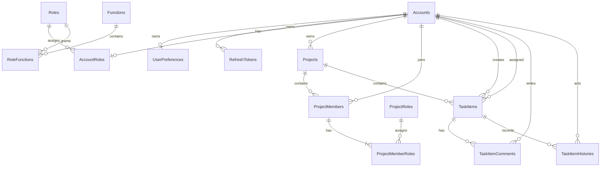

# Project Management Web 資料模型

## 版本與真相來源

本文是依目前 Backend `ApplicationDbContext`、EF Core migrations 與 model snapshot 整理的規格摘要。可實際部署的 Database Schema 以下列檔案為唯一版本來源：

- `ProjectManagementWeb_BackEnd/src/ProjectManagementWeb.Infrastructure/Persistence/Migrations/`
- `ProjectManagementWeb_BackEnd/src/ProjectManagementWeb.Infrastructure/Persistence/Migrations/ApplicationDbContextModelSnapshot.cs`

Backend `docs/TableSchema.md` 提供完整欄位、Index 與 Foreign Key 對照。Schema 變更必須修改 EF mapping、產生 migration，並回頭同步本文與 `docs/TableSchema.md`。

## 設計慣例

| 項目 | 規則 |
|---|---|
| 主鍵 | 業務實體與 Identity Account／Role 主要使用 `uniqueidentifier` |
| 密碼 | 只保存 ASP.NET Core Identity `PasswordHash`，不存明文或可逆密碼 |
| 時間 | 業務時間使用 `datetimeoffset`，程式以 UTC 處理 |
| Enum | 以字串儲存，例如 `Pending`、`InProgress` |
| 軟刪除 | `Projects`、`TaskItems`、`TaskItemComments` 以 `DeletedAt` 與 query filter 處理 |
| 並行控制 | `Projects`、`TaskItems`、`TaskItemComments` 使用 SQL Server `rowversion` |
| Schema 演進 | 只使用 EF Core migrations，不使用 `EnsureCreated` |

## 核心關係

## Identity 與授權

### Accounts

- `Id uniqueidentifier` PK。
- `UserName nvarchar(256)`；`NormalizedUserName` 使用 filtered UNIQUE index。
- `Email nvarchar(256)`；`NormalizedEmail` 目前只有一般 index，應用層要求 Email 唯一。
- `PasswordHash nvarchar(max)` 由 ASP.NET Core Identity 維護。
- `Name nvarchar(100)`、`Remark nvarchar(500)`、`EmailConfirmed bit`、`IsEnabled bit`、`TokenVersion int`。
- Identity 其他欄位包含 SecurityStamp、ConcurrencyStamp、Lockout 與 AccessFailedCount。

### Roles、AccountRoles、Functions、RoleFunctions

- `Roles` 使用 GUID PK，系統角色為 `Admin`、`Administrator`、`User`、`Viewer`。
- `AccountRoles(UserId, RoleId)` 使用複合 PK，並以 `UserId` UNIQUE index 保證每個帳號最多一個系統角色。
- `Functions.Code nvarchar(100)` 為 UNIQUE；`RoleFunctions(RoleId, FunctionId)` 使用複合 PK。
- ASP.NET Core Identity 另建立 `AccountClaims`、`AccountLogins`、`AccountTokens` 與 `RoleClaims` 支援資料表；其主鍵與 Foreign Key 沿用 Identity mapping。

### RefreshTokens 與 UserPreferences

- `RefreshTokens` 保存 `TokenHash nvarchar(64)` UNIQUE、Account、Family、到期、建立、撤銷與取代 token ID。不保存 refresh token 原文。
- `ReplacedByTokenId` 目前是應用層邏輯參照，尚未建立 Database Foreign Key。
- `UserPreferences.AccountId` 同時是 PK 與 Accounts FK，保存 `SkipBatchConfirmation bit`。

## 專案與成員

### Projects

| 欄位 | 規格 |
|---|---|
| `Id` | `uniqueidentifier` PK |
| `Code` | `nvarchar(50)`，未刪除資料使用 filtered UNIQUE index |
| `Name` | `nvarchar(200)` NOT NULL，trim 後 1–200 字 |
| `Description` | `nvarchar(4000)` NULL，選填 |
| `OwnerAccountId` | FK → `Accounts.Id`，Delete Restrict |
| `Status` | `Pending | Active | Completed | Archived` |
| `VersionNumber` | `int` NOT NULL，預設 1 |
| 時間 | `CreatedAt`、`UpdatedAt`、`DeletedAt` |
| `RowVersion` | SQL Server `rowversion` concurrency token |

### ProjectMembers、ProjectRoles、ProjectMemberRoles

- `ProjectMembers(ProjectId, AccountId)` 使用複合 PK，代表一筆專案成員資格，並保存 `JoinedAt`。
- `ProjectRoles` 使用 GUID PK，Code 為 `ProjectManager`、`FrontendDeveloper`、`BackendDeveloper`、`SystemAnalyst`、`Member`。
- `ProjectMemberRoles(ProjectId, AccountId, ProjectRoleId)` 使用三欄複合 PK，允許同一成員具有多個不同 Project Role，並防止同一角色重複。
- `(ProjectId, AccountId)` 是指向 `ProjectMembers` 的複合 FK；`ProjectRoleId` 指向 `ProjectRoles`。

## Task 與留言

### TaskItems

| 欄位 | 規格 |
|---|---|
| `Id` | `uniqueidentifier` PK |
| `Code` | `nvarchar(50)`，目前為全系統範圍的 filtered UNIQUE index |
| `ProjectId` | FK → `Projects.Id`，Delete Restrict |
| `Title` | `nvarchar(300)` NOT NULL |
| `Description` | SQL Server `nvarchar(max)` NULL，EF 邏輯上限 8000 字 |
| `CreatedByAccountId` | FK → `Accounts.Id`，Delete Restrict |
| `AssignedAccountId` | FK → `Accounts.Id`，Delete Restrict |
| 時間 | `StartAt`、`Deadline`、`CreatedAt`、`UpdatedAt`、`DeletedAt` |
| `Status` | `Pending | InProgress | Blocked | Completed` |
| `RowVersion` | SQL Server `rowversion` concurrency token |

### TaskItemComments 與 TaskItemHistories

- `TaskItemComments` 使用 GUID PK，指向 Task 與 Author；`Content nvarchar(2000)` 必填，並具有 CreatedAt、UpdatedAt、DeletedAt 與 RowVersion。
- `TaskItemHistories` 使用 GUID PK，指向 Task 與 Actor；保存 `Action nvarchar(30)`、`Snapshot nvarchar(max)` JSON 與 CreatedAt。
- Task 軟刪除不實體刪除留言或歷史。

## 系統記錄

### BusinessCodeCounters

- PK 為 `(CodeType, BusinessDate)`，`CodeType` 只允許 `Project` 或 `Task`。
- `LastValue` 限制在 1–999999；產號與建立實體使用同一 Serializable transaction。
- 編號格式為 `PRJ-YYYYMMDD######` 與 `TASK-YYYYMMDD######`。

### AuditLogs

- 使用 GUID PK，保存 Actor、Action、EntityType、EntityId、異動前後 JSON 與 CreatedAt。
- `ActorAccountId` 允許 NULL，系統操作不必偽裝成使用者。

### EmailMessages

- 使用 GUID PK，保存 Recipient、Subject、Body、Status、AttemptCount、LastError、CreatedAt 與 SentAt。
- 目前主要支援 Email 驗證信，Recipient 沒有 Accounts FK。
- Task 到期提醒尚未實作，現行 Schema 也尚未有可保證 `(TaskItemId, RecipientAccountId, ReminderDate)` 唯一的提醒紀錄。實作時必須透過新 migration 新增，不得把本文的 Planned 說明視為已建立的資料表。

## 已知的 Schema 缺口

- `Accounts.NormalizedEmail` 尚無 Database UNIQUE constraint，與 runtime unique Email 規則尚未完全對齊。
- `RefreshTokens.ReplacedByTokenId` 尚無 self-referencing Foreign Key。
- Task 到期提醒的紀錄、唯一性、claim／retry 狀態尚未落地。

上述項目是已知缺口，不得在測試或文件中當作已實作。
