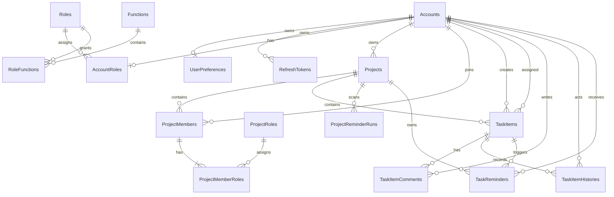

# Project Management Web 資料模型

## 版本與真相來源

本文於 2026-09-24 依目前 Backend `ApplicationDbContext`、EF Core migrations 與 model snapshot 重新核對。可實際部署的 Database Schema 以下列檔案為唯一版本來源：

- `ProjectManagementWeb_Backend/src/ProjectManagementWeb.Infrastructure/Persistence/Migrations/`
- `ProjectManagementWeb_Backend/src/ProjectManagementWeb.Infrastructure/Persistence/Migrations/ApplicationDbContextModelSnapshot.cs`

Backend `docs/TableSchema.md` 提供完整欄位、Index 與 Foreign Key 對照。Schema 變更必須修改 EF mapping、產生 migration，並回頭同步本文與 `docs/TableSchema.md`。

## 設計慣例

| 項目 | 規則 |
|---|---|
| 主鍵 | 業務實體與 Identity Account／Role 主要使用 `uniqueidentifier` |
| 密碼 | 只保存 ASP.NET Core Identity `PasswordHash`，不存明文或可逆密碼 |
| 時間 | 業務時間使用 `datetimeoffset`，程式以 UTC 處理 |
| Enum | 以字串儲存，例如 `Pending`、`InProgress` |
| 軟刪除 | `Projects`、`TaskItems`、`TaskItemComments` 以 `DeletedAt` 與 query filter 處理 |
| 並行控制 | `Projects`、`TaskItems`、`TaskItemComments` 使用 SQL Server `rowversion` |
| Schema 演進 | 只使用 EF Core migrations，不使用 `EnsureCreated` |

## 核心關係

## Identity 與授權

### Accounts

- `Id uniqueidentifier` PK。
- `UserName nvarchar(256)`；`NormalizedUserName` 使用 filtered UNIQUE index。
- `Email nvarchar(256)`；`NormalizedEmail nvarchar(256)` NOT NULL，使用無 filter UNIQUE index 保證 Email 唯一。
- `PasswordHash nvarchar(max)` 由 ASP.NET Core Identity 維護。
- `Name nvarchar(100)`、`Remark nvarchar(500)`、`EmailConfirmed bit`、`IsEnabled bit`、`TokenVersion int`。
- `PhoneNumber nvarchar(max)` 與 `PhoneNumberConfirmed bit` 沿用 ASP.NET Core Identity 欄位。Application contract 將電話限制為 trim 後最多 30 字且須符合電話格式；空白正規化為 `NULL`，電話異動後將 `PhoneNumberConfirmed` 重設為 false。這個 30 字限制目前是應用層規則，尚未縮小資料庫欄位型別。
- Identity 其他欄位包含 SecurityStamp、ConcurrencyStamp、Lockout 與 AccessFailedCount。
- `GET/PUT /users/me/profile` 只允許目前登入者讀寫自己的 `Name` 與 `PhoneNumber`；成功更新會寫 AuditLog，但只記錄異動欄位名稱，不保存名稱或電話內容。
- Bootstrap Admin 由 `BootstrapAdmin:Account` 設定辨識，不是另一張資料表或靜態 seed row。使用者清單及 Project member candidates 會在 Application 查詢層排除該帳號；直接異動仍由後端規則拒絕。

### Roles、AccountRoles、Functions、RoleFunctions

- `Roles` 使用 GUID PK，系統角色為 `Admin`、`Administrator`、`User`、`Viewer`。
- `AccountRoles(UserId, RoleId)` 使用複合 PK，並以 `UserId` UNIQUE index 保證每個帳號最多一個系統角色。
- `Functions.Code nvarchar(100)` 為 UNIQUE；`RoleFunctions(RoleId, FunctionId)` 使用複合 PK。
- ASP.NET Core Identity 另建立 `AccountClaims`、`AccountLogins`、`AccountTokens` 與 `RoleClaims` 支援資料表；其主鍵與 Foreign Key 沿用 Identity mapping。

### RefreshTokens 與 UserPreferences

- `RefreshTokens` 保存 `TokenHash nvarchar(64)` UNIQUE、Account、Family、到期、建立、撤銷與取代 token ID。不保存 refresh token 原文。
- `ReplacedByTokenId` 是 nullable self-referencing FK，Delete NoAction；正常生命週期只撤銷，不實體刪除 Token。
- `UserPreferences.AccountId` 同時是 PK 與 Accounts FK，保存 `SkipBatchConfirmation bit`。

## 專案與成員

### Projects

| 欄位 | 規格 |
|---|---|
| `Id` | `uniqueidentifier` PK |
| `Code` | `nvarchar(50)`，未刪除資料使用 filtered UNIQUE index |
| `Name` | `nvarchar(200)` NOT NULL，trim 後 1–200 字 |
| `Description` | `nvarchar(4000)` NULL，選填 |
| `OwnerAccountId` | FK → `Accounts.Id`，Delete Restrict |
| `TimeZoneId` | `nvarchar(100)` NOT NULL，合法 IANA timezone ID |
| `Status` | `Pending | Active | Completed | Archived` |
| `VersionNumber` | `int` NOT NULL，預設 1 |
| 軟刪除 | `DeletedAt`、`DeletedByAccountId` nullable FK → `Accounts.Id`，Delete NoAction |
| 時間 | `CreatedAt`、`UpdatedAt`、`DeletedAt` |
| `RowVersion` | SQL Server `rowversion` concurrency token |

- `TimeZoneId` 已由 `AddProjectTimeZone` migration 新增。新 Project 必須明確提供；既有資料由部署必填的 `PMW_MIGRATION_DEFAULT_TIME_ZONE_ID` 回填，設定缺少或無效時 migration fail-fast。
- `DeletedByAccountId` 已由 `AddProjectSoftDeleteActor` migration 新增；Project 軟刪除不 cascade 實體刪除成員、Task、Comment 或 history。
- `OwnerAccountId` 的 FK 只能保證帳號存在；Owner 必須已啟用、Email 已驗證且系統角色恰為 `Administrator` 的規則，由 Application use case 在建立與修改時驗證。建立時 Owner membership 與 `ProjectManager` mapping 會在同一交易建立；修改時，新 Owner 另須已是該 Project 成員，缺少 `ProjectManager` 時由同一交易補上。舊 Owner 的 Project Role mappings 不會自動刪除。

### ProjectMembers、ProjectRoles、ProjectMemberRoles

- `ProjectMembers(ProjectId, AccountId)` 使用複合 PK，代表一筆專案成員資格，並保存 `JoinedAt`。
- `ProjectRoles` 使用 GUID PK，Code 為 `ProjectManager`、`FrontendDeveloper`、`BackendDeveloper`、`SystemAnalyst`、`Member`。
- `ProjectMemberRoles(ProjectId, AccountId, ProjectRoleId)` 使用三欄複合 PK，允許同一成員具有多個不同 Project Role，並防止同一角色重複。
- `(ProjectId, AccountId)` 是指向 `ProjectMembers` 的複合 FK；`ProjectRoleId` 指向 `ProjectRoles`。

## Task 與留言

### TaskItems

| 欄位 | 規格 |
|---|---|
| `Id` | `uniqueidentifier` PK |
| `Code` | `nvarchar(50)`，目前為全系統範圍的 filtered UNIQUE index |
| `ProjectId` | FK → `Projects.Id`，Delete Restrict |
| `Title` | `nvarchar(300)` NOT NULL |
| `Description` | SQL Server `nvarchar(max)` NULL，EF 邏輯上限 8000 字 |
| `CreatedByAccountId` | FK → `Accounts.Id`，Delete Restrict |
| `AssignedAccountId` | FK → `Accounts.Id`，Delete Restrict |
| 時間 | `StartAt`、`Deadline`、`CreatedAt`、`UpdatedAt`、`DeletedAt` |
| `Status` | `Pending | InProgress | Blocked | Completed` |
| `RowVersion` | SQL Server `rowversion` concurrency token |

### TaskItemComments 與 TaskItemHistories

- `TaskItemComments` 使用 GUID PK，指向 Task 與 Author；`Content nvarchar(2000)` 必填，並具有 CreatedAt、UpdatedAt、DeletedAt 與 RowVersion。
- `TaskItemHistories` 使用 GUID PK，指向 Task 與 Actor；保存 `Action nvarchar(30)`、`Snapshot nvarchar(max)` JSON 與 CreatedAt。
- Task 軟刪除不實體刪除留言或歷史。

## 系統記錄

### BusinessCodeCounters

- PK 為 `(CodeType, BusinessDate)`，`CodeType` 只允許 `Project` 或 `Task`。
- `LastValue` 限制在 1–999999；產號與建立實體使用同一 Serializable transaction。
- 編號格式為 `PRJ-YYYYMMDD######` 與 `TASK-YYYYMMDD######`。

### AuditLogs

- 使用 GUID PK，保存 Actor、Action、EntityType、EntityId、異動前後 JSON 與 CreatedAt。
- `ActorAccountId` 允許 NULL，系統操作不必偽裝成使用者。

### EmailMessages

- 使用 GUID PK，保存 Recipient、Subject、Body、Status、AttemptCount、LastError、CreatedAt 與 SentAt。
- 目前支援 Email 驗證信，Recipient 沒有 Accounts FK；Task 到期提醒使用獨立 `TaskReminders` 狀態表與 SMTP gateway。

### ProjectReminderRuns 與 TaskReminders

- `ProjectReminderRuns` 使用 GUID PK，保存 ProjectId、`ReminderDate date`、StartedAt、CompletedAt 與 Created／Duplicate／Skipped 摘要計數；`(ProjectId, ReminderDate)` UNIQUE，保證同一 Project／當地日期只取得一次掃描資格。
- `TaskReminders` 使用 GUID PK，分別以 NoAction FK 指向 Project、Task 與 Recipient Account；`(TaskItemId, RecipientAccountId, ReminderDate)` UNIQUE，避免同日同收件人重複提醒。
- 狀態為 `Pending | Processing | Retry | Sent | Failed | Cancelled`；保存 AttemptCount、RetryCount、NextAttemptAt、ClaimedAt、ClaimToken、SentAt、ProviderResponseId、LastError、CancellationReason 與 AlertedAt。
- `(Status, NextAttemptAt)` index 支援到期工作 claim。Worker 以 SQL `UPDLOCK`、`READPAST`、`ROWLOCK` 原子取得寄送權，claim lease 為 5 分鐘；最終失敗以 Failed／AlertedAt 與安全結構化 Warning Log 追蹤，不提供管理 UI。
- `AddTaskReminders` migration 建立上述資料表；Hangfire schema 由 migrator 權限帳號初始化，API runtime 不需要 DDL 權限。

### EmailVerificationTokens

- 使用 GUID PK，保存 `AccountId`、`EmailMessageId`、SHA-256 `TokenHash`、CreatedAt、ExpiresAt、ActivatedAt、UsedAt 與 InvalidatedAt；不另存 Token 原文。
- `TokenHash` 使用 UNIQUE index；`EmailMessageId` 為一對一 UNIQUE FK。
- filtered UNIQUE index 保證同一帳號同時最多只有一個已啟用且尚未使用／失效的 Token。
- Token 自簽發起 3 分鐘到期；只有 SMTP 成功後才啟用並使舊 Token 失效。SMTP 失敗時新 Token 標示失效，舊 Token 保持原狀。

### EmailVerificationResendAttempts

- 使用 GUID PK，保存 nullable `AccountId`、SHA-256 `ClientAddressHash`、RequestedAt 與 Outcome；不保存來源 IP 原文。
- `(ClientAddressHash, RequestedAt)` 與 `(AccountId, Outcome, RequestedAt)` index 支援 IP／帳號滾動視窗與 60 秒冷卻查詢。
- 不存在帳號仍建立沒有 AccountId 的嘗試紀錄，以便套用 IP 上限；只有 Outcome=`Allowed` 的請求會建立新 Token 與 EmailMessage。

### LoginFailureAttempts

- 使用 GUID PK，保存 SHA-256 `AccountKeyHash`、SHA-256 `ClientAddressHash`、OccurredAt 與 Outcome；不保存帳號或來源 IP 原文，也不建立 Accounts FK。
- `(AccountKeyHash, Outcome, OccurredAt)` 與 `(ClientAddressHash, Outcome, OccurredAt)` index 支援帳號／IP 的滾動 15 分鐘視窗查詢，供所有應用執行個體共用。
- Outcome 為 `InvalidCredentials` 或 `RateLimited`；只有 `InvalidCredentials` 計入限制門檻，避免受限請求無限延長視窗。紀錄不自動刪除，後續若需 retention 由獨立維運流程處理。

## 本輪資料完整性狀態

- `Accounts.NormalizedEmail` 的 NOT NULL／UNIQUE、`RefreshTokens.ReplacedByTokenId` self-FK，以及 Task 到期提醒的唯一性、claim、retry、取消與告警狀態均已由 migration 落地。
- 本人名稱與電話功能沿用既有 `Accounts.Name` 與 Identity `PhoneNumber`，因此沒有新增 migration；目前 30 字電話上限只由 Application 與 Frontend 驗證。若未來需要 DB 層長度保護，須另建 migration 將 `PhoneNumber` 縮為 `nvarchar(30)`，並先檢查既有資料。
- 真實 SQL Server 回歸已驗證髒資料 fail-fast、FK delete behavior、唯一限制與多 worker concurrency；後續 Schema 異動仍須同步 EF mapping、migration、model snapshot 與本文件。
